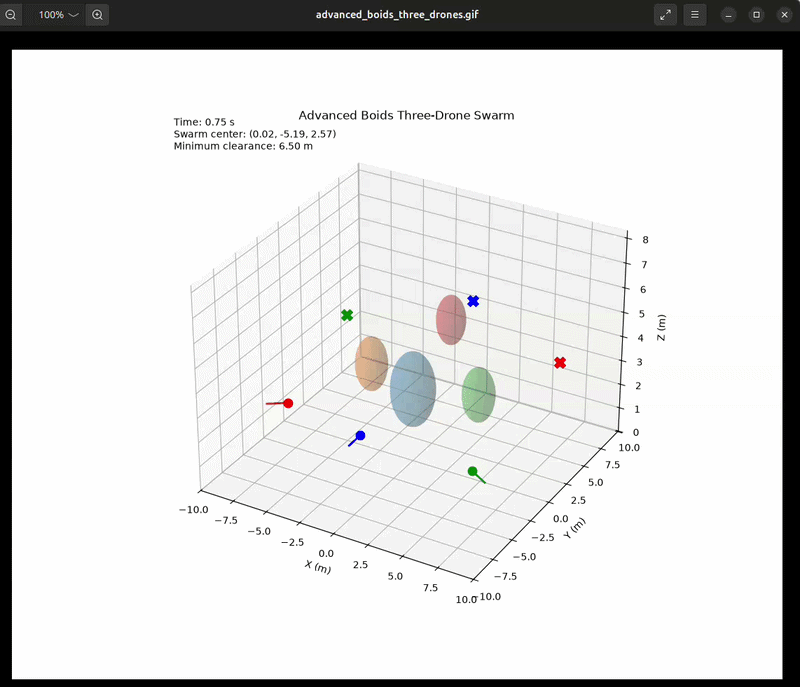

# 🐦 Boids-Based Three-Drone Swarm

A three-drone swarm simulation implementing the **Boids flocking algorithm** for decentralized swarm coordination.

## 📌 Overview

Boids is a classic swarm-intelligence algorithm that reproduces collective behavior using simple local rules.

Each drone reacts only to nearby drones instead of relying on a centralized swarm controller.

The three fundamental rules are:

1. **Separation**
2. **Alignment**
3. **Cohesion**

A goal-seeking component is also included to allow the swarm to move toward a target.



## 🧠 Boids Rules

### 1. Separation

Keeps drones from getting too close.

```text
       D1
        ↖
          ↖
            D2
          ↙
        ↙
       D3
```

The drone generates a repulsive velocity when another drone gets too close.

### 2. Alignment

Encourages drones to travel in similar directions.

```text
D1 ─────►
D2 ─────►
D3 ─────►
```

### 3. Cohesion

Pulls drones toward the center of the local swarm.

```text
       D1

        ↓
        ●  ← Center
       ↙ ↘

     D2   D3
```

### 4. Goal Seeking

Moves the swarm toward a desired target.

```text
Swarm ───────────────► Target
```

## 🔗 Combined Behavior

The drone's final velocity is determined from the weighted combination of these behaviors.

```text
Separation
     +
Alignment
     +
Cohesion
     +
Goal Seeking
     ↓
Final Velocity
     ↓
Drone Motion
```

## 🎯 Objectives

* Simulate decentralized swarm behavior.
* Maintain a cohesive three-drone formation.
* Avoid drones getting too close.
* Maintain similar movement directions.
* Navigate toward a target.
* Study emergent swarm behavior.

## ⚙️ Parameters

| Parameter           | Purpose                          |
| ------------------- | -------------------------------- |
| `separation_weight` | Strength of repulsion            |
| `alignment_weight`  | Strength of directional matching |
| `cohesion_weight`   | Strength of swarm attraction     |
| `goal_weight`       | Strength of target attraction    |
| `neighbor_radius`   | Local perception range           |
| `max_speed`         | Maximum drone velocity           |
| `dt`                | Simulation time step             |

## ▶️ Run

```bash
python boids_three_drones.py
```

## 📊 Evaluation

The simulation can be evaluated using:

* Formation stability
* Inter-drone distance
* Goal convergence
* Path length
* Collision count
* Swarm cohesion
* Alignment error

## ⚠️ Limitations

Pure Boids does not provide guaranteed collision avoidance or global path planning.

Therefore, a more robust UAV system can combine Boids with ORCA or APF.

```text
Boids
  ↓
Swarm Coordination

ORCA
  ↓
Collision Avoidance

Waypoint Planner
  ↓
Global Navigation
```

## 🔬 Future Work

* Dynamic obstacles
* Formation control
* Adaptive Boids weights
* ORCA + Boids hybrid
* ROS 2 implementation
* PX4/Gazebo integration
* Real-world swarm testing
